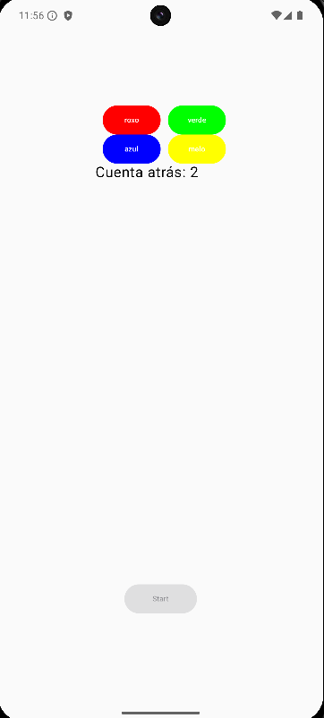

# examenMVVM

## Descripción de cambios:
En la clase MyViewModel se a añadido una nueva función llamada 
-`iniciarCuentaAtrás` esta cambia el estado a CONTANDO e inícia
un viewModelScope en el que se siguien los siguientes pasos:

ponemos la cuenta atrás con un downTo para que esta comience de forma regresiva
y le damos a cuentaAtrasLiveData.value el valor que tenga actualmente "i" para 
mostrarlo posteriormente por pantalla

´´´

 //inicia la cuenta atás regresiva desde 5
            for (i in 5 downTo 1) {
                cuentaAtrasLiveData.value = i
                Log.d(TAG_LOG, "Cuenta atrás: $i")
 //Hacemos que la corrutina espere 1 segundo antes de continuar
                delay(1000)
            }
            
´´´

Luego en la función -`crearRandom` llamamos a esta función
con el objetivo de que arranque nada mas pulsar el botón start

´´´

iniciarCuentaAtras()

´´´
En la clase IU seguimos unos pasos muy simples para poder mostrarla por pantalla:
Lo primero que tenemos que hacer es crear una variable cuentaAtras e igualarla al 
-`cuentaAtrasLiveData` anteriormente mencionado, pero en este caso usaremos 
-`observeAsState` para que la IU se actualice cuando cambia el estado y le damos el 
valor inicial de 5:

´´´

val cuentaAtras by miViewModel.cuentaAtrasLiveData.observeAsState(initial = 5)

´´´

Finalmente, debajo de los botones en horizontal y encima del botón start 
creamos un cuadro de texto que mostrará la cuenta cuando comience y se detendrá
cuando llegue a 1, reiniciando el estado de la aplicación.

nota: la cuenta atrás se reinicia de nuevo pulsando el botón start,si termina 
permanece igualada a 1 hasta que el botón start se pulsa de nuevo

´´´

Text("Cuenta atrás: $cuentaAtras", fontSize = 20.sp)

´´´

## Demostración de funcionamiento:
En la siguiente imágen podemos ver como funciona la cuenta atrás, esta se activa al momento de pulsar
el botón start y empieza a contar desde cinco hacia atrás, llegado al número 1 esta se detiene devolviendo el estado de la aplicación al inicio,reiniciando el juego

## Planteamiento de mejora

La mejora que propongo es almacenar la variable i que se utiliza en la clase MyViewModel 
para hacer la cuenta atrás en la clase datos, ya que esta es utilizada y creada dentro de la propia función, para posteriormente igualar su valor a otra variable que lo mostrará en la UI, guardar esa variable en la clase datos pordía solucionar problemas como que al darle un valor inicial por defecto,esta puede ser reiniciada más facilmente al acabar la cuenta atrás y que vuelva a ser 5 al terminarse esta.
